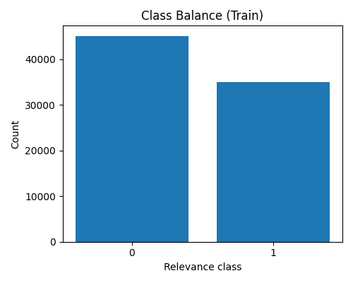
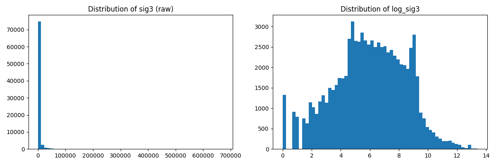
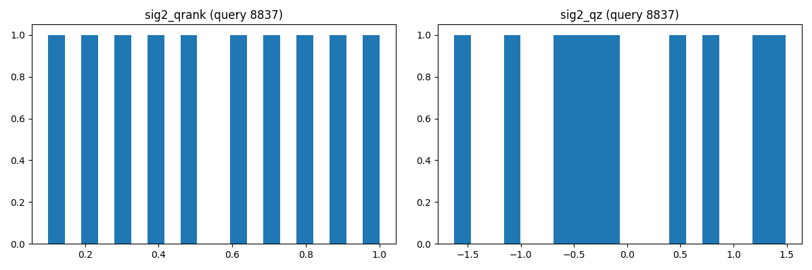
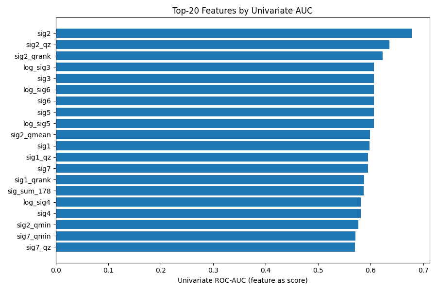
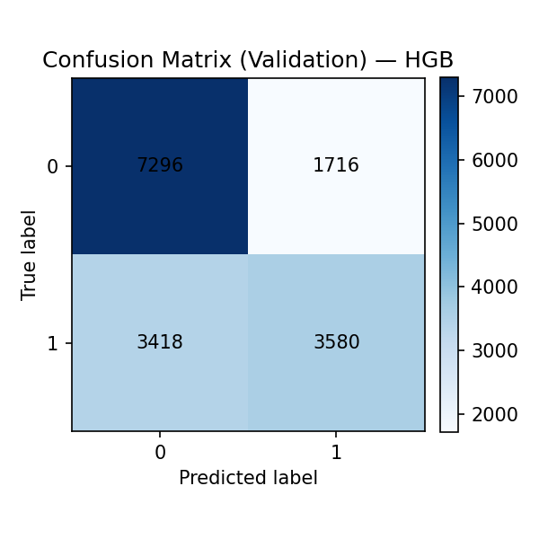
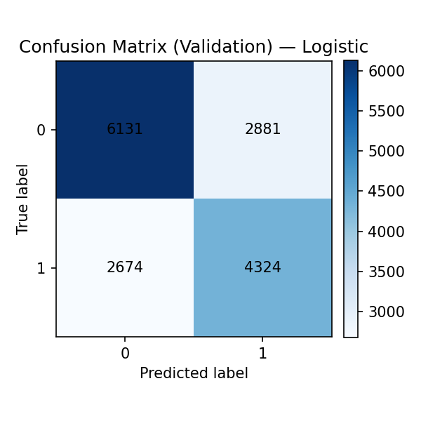
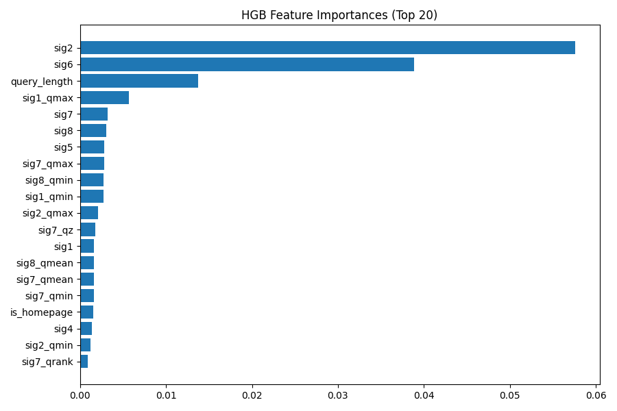
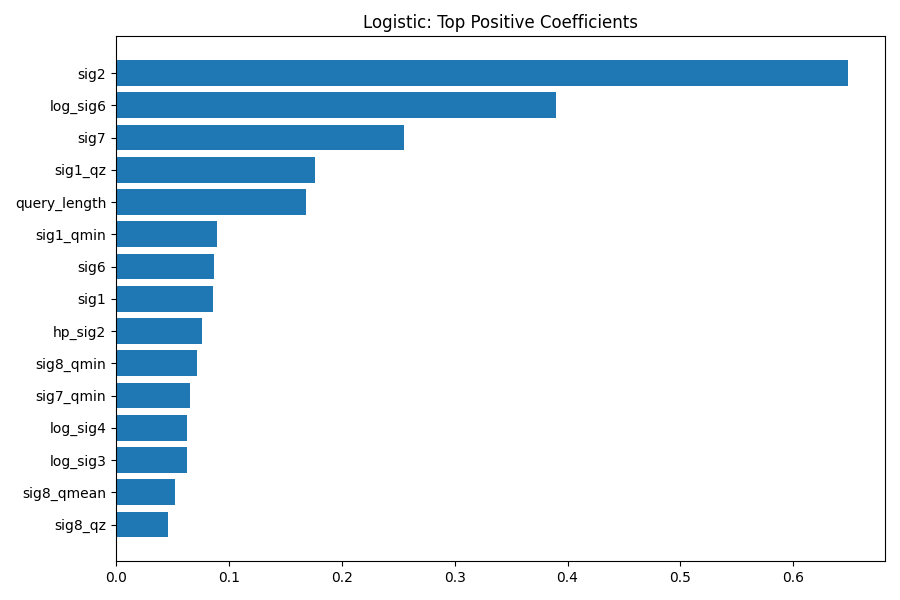
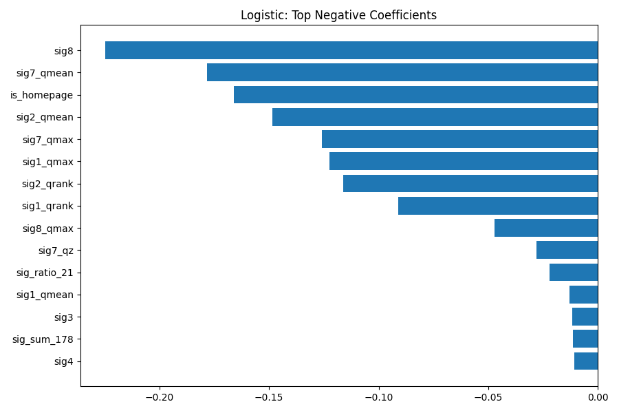

# Predicting Query–URL Relevance (Stanford University STATS202 Final Project)

Machine learning pipeline for predicting whether a URL is **relevant to a search query**, built using classification models and feature engineering techniques from statistical learning.

I developed this project for **STATS 202: Statistical Learning and Data Science (Stanford Summer Session)**.

The goal is to classify each query‑URL pair as:

- **1 → Relevant**
- **0 → Not Relevant**

using engineered ranking signals and supervised learning models.

---

# Problem

Search engines must determine which URLs are most relevant for a given query. This project builds a predictive model that learns this relationship from labeled data.

Dataset:

- **80,046 training observations**
- **30,001 test observations**
- 10 base features describing the query‑URL pair

Examples of raw signals:

- `sig1` – `sig8` ranking signals
- `query_length`
- `is_homepage`

> **Note:** The raw dataset files are not included in this repository. To run the code, place `training.csv` and `test.csv` inside `data/raw/`.

---

# Dataset Exploration

### Class Balance

The dataset is moderately imbalanced.



Approximately:

- **56% not relevant**
- **44% relevant**

---

# Feature Engineering

Several transformations were applied to improve model performance during the final project analysis.

### Log Transformations

Count‑like features such as `sig3` showed heavy right skew. A `log1p` transform stabilizes scale and reduces the influence of extreme values.



---

### Per‑Query Context Features

Signals were normalized within each query using:

- percentile ranks
- z‑scores

This captures **relative relevance within the query context**.



---

### Univariate Feature Strength

To understand which signals were individually predictive, I computed **ROC‑AUC for each feature** during exploratory analysis.



The strongest individual predictors included:

- `sig2`
- `sig2_qz`
- `sig2_qrank`
- `log_sig3`

---

# Models

Two classification models were explored.

## HistGradientBoostingClassifier

Tree‑based gradient boosting.

Advantages:

- captures nonlinear relationships
- handles feature interactions automatically
- robust to feature scaling

Key parameters used during experimentation:

```
max_depth = 6
learning_rate = 0.06
max_iter = 350
```

---

## Logistic Regression

Standard statistical classification model.

Used for:

- interpretability
- coefficient inspection

Features were standardized using `StandardScaler`, and `class_weight="balanced"` was used to account for mild class imbalance during experiments.

---

# Model Evaluation

The figures below summarize evaluation results from the final project analysis described in the report. The scripts in this repository focus primarily on generating prediction outputs rather than reproducing the full evaluation pipeline used during the report.

### Confusion Matrices

**HistGradientBoosting**



**Logistic Regression**



---

# Feature Importance

The boosted model identified the following features as most influential during analysis:

- `sig2`
- `sig6`
- `query_length`



---

# Logistic Regression Interpretation

Coefficient analysis was used to understand which signals increase or decrease the probability of predicting relevance.

### Positive coefficients



### Negative coefficients



---

# Model Blending

During the final project analysis, I also experimented with combining predictions from both models using a weighted average:

```
p_blend = w * p_hgb + (1 - w) * p_logistic
```

Example parameters explored in the report analysis:

```
w ≈ 0.96
threshold ≈ 0.498
```

The blended model produced a small improvement in validation performance in the report experiments.

---

# Repository Structure

```
stats202-final-project
│
├── data/
│   └── raw/                              # place training.csv and test.csv here
│
├── src/
│   ├── data/
│   │   └── create_validation_split.py
│   ├── models/
│   │   ├── generate_logistic_regression_submission.py
│   │   ├── tune_hist_gradient_boosting_threshold.py
│   │   └── generate_histgb_logreg_blend_submission.py
│   └── utils/
│       └── feature_engineering.py
│
├── results/
│   ├── submissions/
│   └── validation/
│
├── report/
│   ├── STATS202_Final_Project_Report.pdf
│   └── figures/
│
├── archive/
│   ├── legacy_gradient_boosting/
│   └── legacy_random_forest/
│
├── requirements.txt
└── README.md
```

---

# How to Run

Install dependencies:

```
pip install -r requirements.txt
```

Place the raw dataset files in:

```
data/raw/training.csv
data/raw/test.csv
```

Then run the scripts from the repository root.

### 1. Preview the validation split

```
python3 src/data/create_validation_split.py
```

### 2. Generate Logistic Regression predictions

```
python3 src/models/generate_logistic_regression_submission.py
```

### 3. Tune the HistGradientBoosting threshold

```
python3 -m src.models.tune_hist_gradient_boosting_threshold
```

### 4. Generate blended HistGradientBoosting + Logistic Regression predictions

```
python3 -m src.models.generate_histgb_logreg_blend_submission
```

Generated outputs are written to the `results/` directory.

---

# Report

Full technical report:

[STATS202 Final Project Report](report/STATS202_Final_Project_Report.pdf)

---

# Author

**Yonish Tayal**  
Boston University — Computer Science

